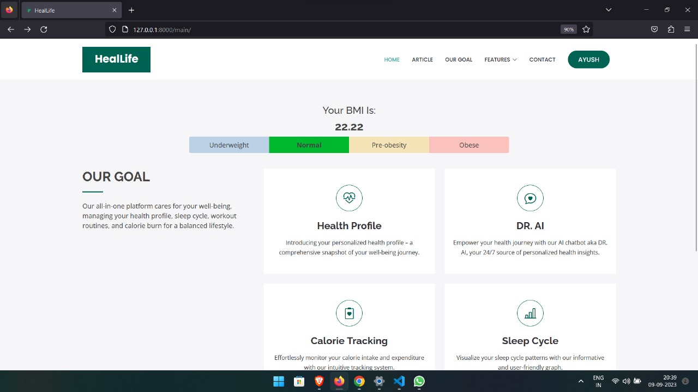
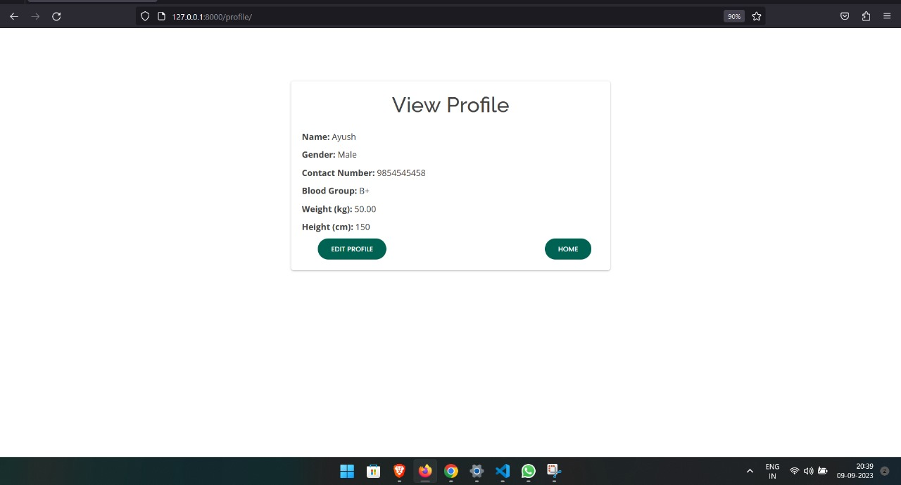
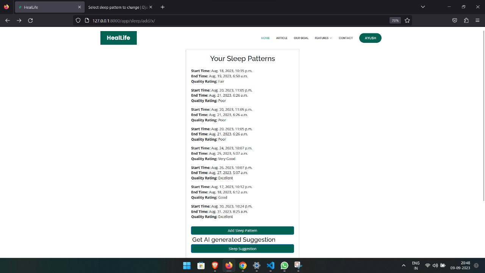
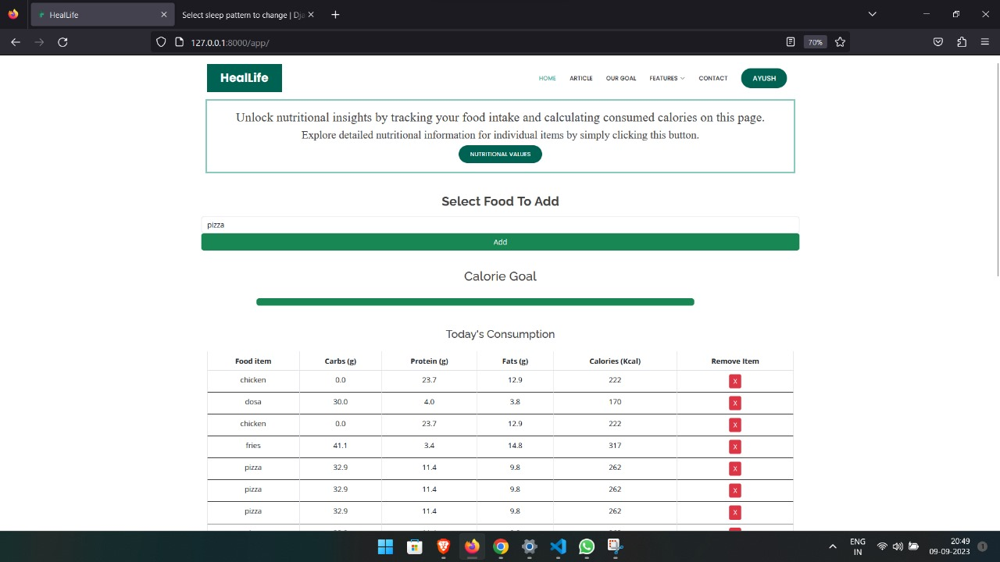
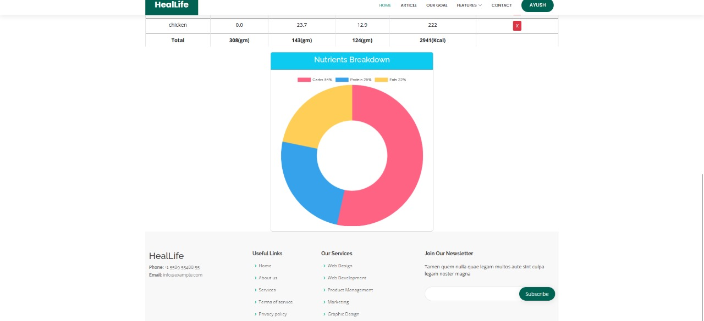
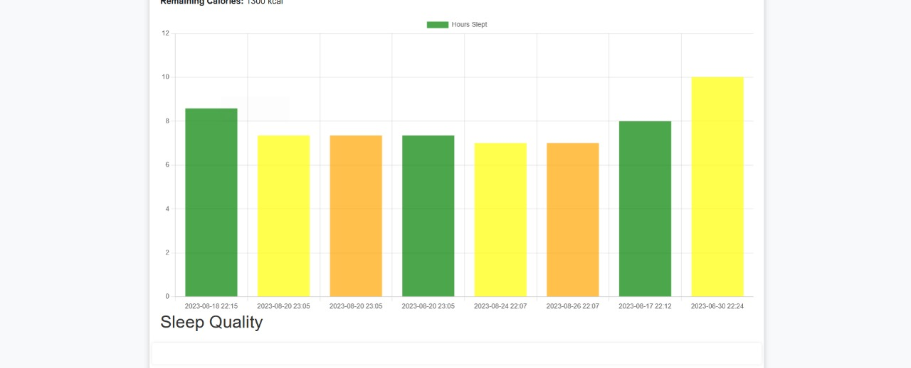
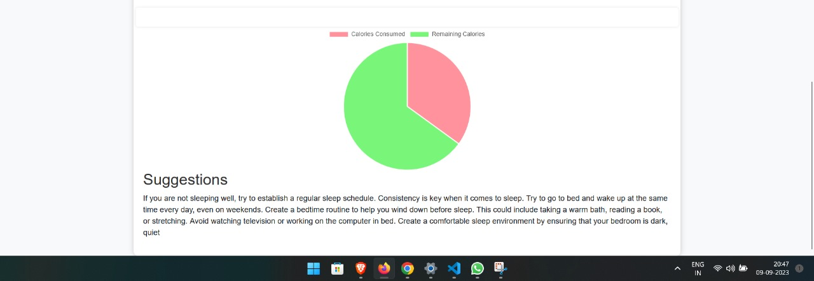

# HealLife App 🏃‍♀️🍏🛌

Track and manage your health and wellness with the HealLife app! 🌟 Get AI-generated health reports based on your calorie tracking and sleep cycle monitoring. Plus, enjoy 24/7 access to a Dr. AI chatbot for all your health concerns. Share your wellness journey with user-generated posts, where even the post content is provided by AI. Stay on top of your health and make healthier lifestyle choices with ease. 🚀

## Features 🌈

- **Calorie Tracking**: Monitor your daily calorie intake and receive personalized diet recommendations. 🥗
- **Sleep Cycle Monitoring**: Track your sleep patterns for better rest and well-being. 😴
- **AI-Generated Health Reports**: Get comprehensive health reports generated by advanced AI. 📊
- **24/7 Dr. AI Chatbot**: Have health questions? Our AI-powered chatbot is available round the clock. 🤖
- **User-Generated Posts**: Share your health journey with posts where even the content is generated by AI. 📝
- **Responsive Dashboard**: Visualize your health data with intuitive charts and graphs. 📈
- **User-friendly Interface**: Enjoy a seamless experience with our clean and intuitive user interface. 🌟
- **Customizable Settings**: Tailor the app to your preferences and goals. ⚙️

## The Team 👥
The people who make it Happen at HealLife:

- **AYUSH JHA** 💻
- **VAISHNAVI SHRIPATI** 💻

## Installation and Usage 🚀

1. Clone the repository: `git clone https://github.com/yourusername/HealLife.git`
3. Navigate to the project directory: `cd HealLife`
4. Install dependencies: `pip install -r requirements.txt`
5. Run the development server: `python manage.py runserver`
6. Access the app in your web browser at `http://localhost:8000`

## Contributing 🤝

Contributions are welcome! Whether you're an experienced developer or new to coding, feel free to contribute. Here's how:

1. Fork the repository
2. Create a new branch: `git checkout -b feature-name`
3. Make your changes and commit: `git commit -m 'Add some feature'`
4. Push to the branch: `git push origin feature-name`
5. Create a pull request 🎉

## Feedback and Support 💬

Have feedback, suggestions, or facing issues? We'd love to hear from you! Feel free to open an issue or contact us at support@heallifeapp.com. 📣

## License 📜

This project is licensed under the [MIT License](LICENSE).

---

Made with ❤️ by the HealLife team. Start your journey to a healthier and happier life! 🌈🏃‍♂️🥦

## Working Images

